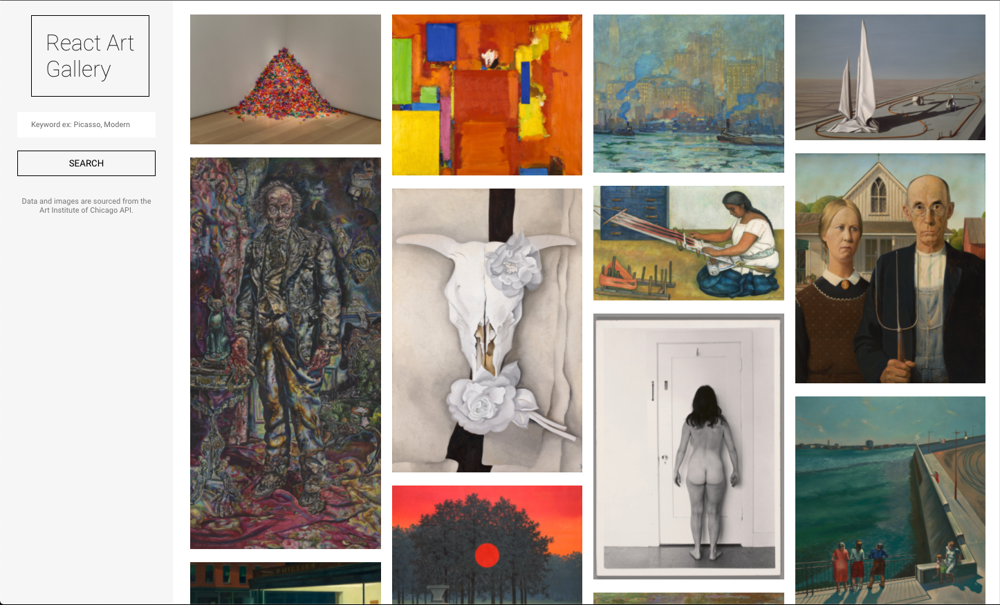

# React Art Gallery
---
React Art Gallery is a front-end web application that utilizes third-party data from the [Art Institute of Chicago API](https://api.artic.edu/docs/#quick-start) to allow users to search, view, and learn more about artworks in their collections.  Made with React, React Router, and CSS.

Clink the following link to view the working application.
[React Art Gallery](https://proj-2-react-art-gallery.herokuapp.com/)

## Technologies and Resources Used
- React.js
- React Router
- CSS
- Third-Party data from [Art Institute of Chicago API](https://api.artic.edu/docs/#quick-start)

## How to Use
Use the search bar to search for artworks by keyword. This keyword can be an artist, an artstyle, a medium, a country of origin - the search will return all artworks whose metadata contains some mention of the keyword.

Click on an artwork to see more details and a larger version of the artwork image. Click on 'Back to Search Rusults' to return to the search results page.

[React Art Gallery](https://proj-2-react-art-gallery.herokuapp.com/)

